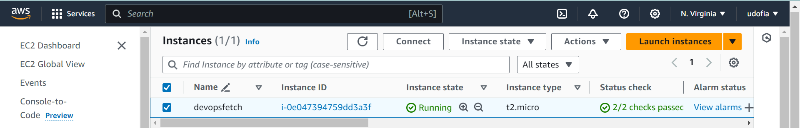
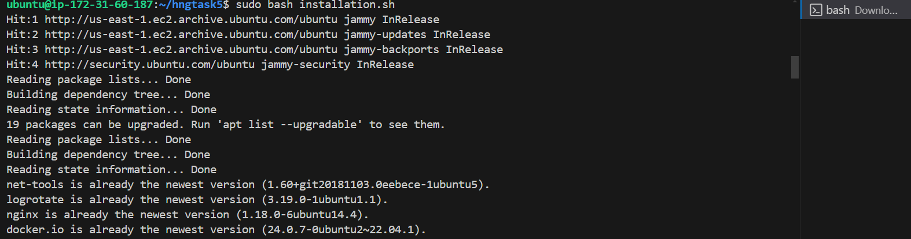
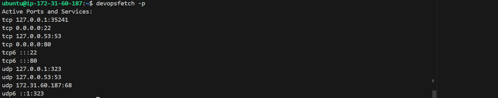
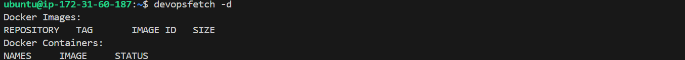
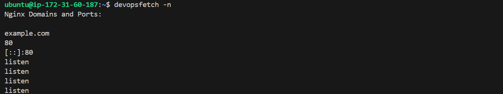
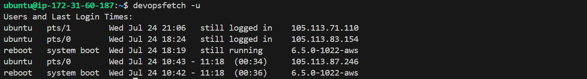

# hngtask6 
DevOps Mid Internship Task

Building devopsfetch for Server Information Retrieval and Monitoring.
- **Objective:** 

Develop a tool for devops named devopsfetch that collects and displays system information, including active ports, user logins, Nginx configurations, Docker images, and container statuses. Implement a systemd service to monitor and log these activities continuously.

 #### Installation and configuration steps.
 Provission an EC2 virtual server 
 
 
 Necessary dependencies and installations scripts configured in files:
 ```
installation.sh
 ```
 ```
devopsfetch.sh
 ```
 run the script

```
sudo bash installation.sh
```


- **Information Retrieval:**
1. **Ports:**
   - Display all active ports and services (-p or --port).
   - Provide detailed information about a specific port (-p <port_number>).

   

2. **Docker:**
   - List all Docker images and containers (-d or --docker).
   - Provide detailed information about a specific container (-d <container_name>).

   

   3. **Nginx:**
   - Display all Nginx domains and their ports (-n or --nginx).
   - Provide detailed configuration information for a specific domain (-n <domain>).



4. **Users:**
   - List all users and their last login times (-u or --users).
   - Provide detailed information about a specific user (-u <username>).

   

   5. **Time Range:**
   - Display activities within a specified time range (-t or --time).
   
   
   
